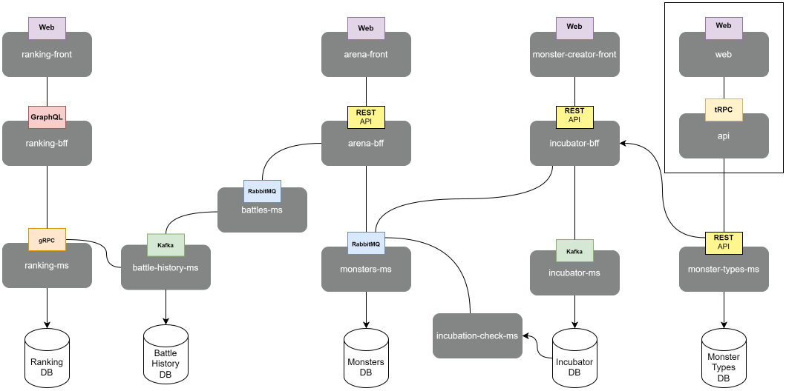

# Portfolio

## Overview

The goal of this project is to apply techniques I have learned throughout my career developing software projects.

The idea is to create an application using a microservices architecture and communicate each of these in different ways using REST, RPC, RabbitMQ, Kafka, etc.

## Microservices

- [Monsters Types Microservice Repository](https://github.com/crisgarlez/portfolio-monster-types-ms)
- [Monsters Microservice Repository](https://github.com/crisgarlez/portfolio-monsters-ms)
- [Battles Microservice Repository](https://github.com/crisgarlez/portfolio-battles-ms)
